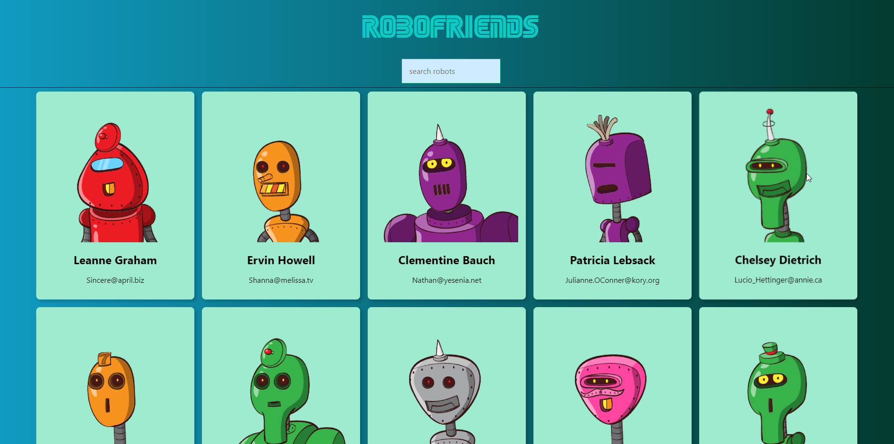
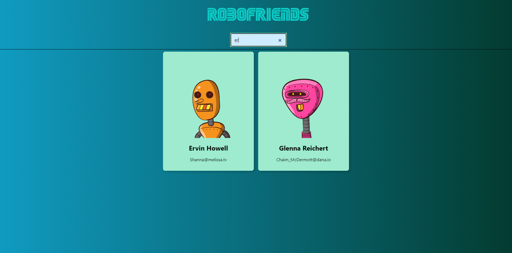

# Robo Friends

## Description
Created with React, RoboFriends pulls in user (robot) data from an API and displays a card for each user. Users can be filtered by name via a textbox input.

[Github Pages Deployment](https://calvinfreese.github.io/Robo)

### Screenshots
* All Robots

* Filtered Robots
